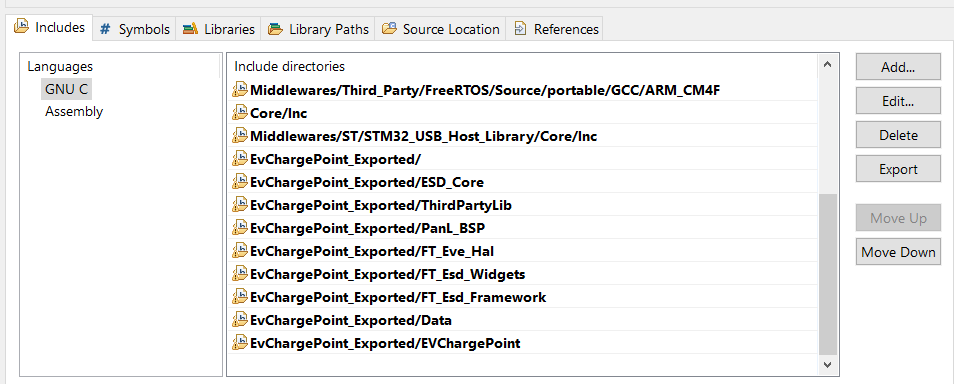
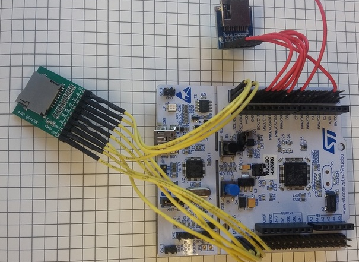

Application Note

BRT_AN_XXX

ESD 4.10 Exported Project Porting Guide for STM32L4 Discovery Board And
FreeRTOS

**Version 0.2**

**Issue Date:** 2022-07-25

This application note is intended as a guide for porting an EVE Screen
Designer (ESD) 4.10 exported project to a non-FT9xx based MCU platform.
Users are expected to have knowledge of ESD 4.10 as well as FT81x and
STM32L4XX MCU

# <u>Table of Contents</u>

1 Introduction 4

1.1 Overview 4

1.2 Scope 4

2 ESD 4.15 Exported Project – Introduction 5

2.1 Opening the Example Project 5

2.2 Exporting the Example Project 5

3 Porting principles 7

3.1 Hardware 7

3.2 Software 7

3.2.1 HAL 7

3.2.2 Project Files 7

3.2.3 Linker Script 7

3.2.4 Exported Code 7

4 Example 8

4.1 Hardware Connection 10

4.1.1 Power and Ground Connection 10

4.1.2 Signal lines Connection 10

4.2 Software Setup 10

4.2.1 Toolchain and Utilities 10

4.3 Project porting procedure 11

4.3.1 Export ESD Generated Source Code 12

4.3.2 Generate project for STM32L4 Discovery board 13

4.3.3 Port ESD generated source code to STM32L4 Discovery’s project 18

4.3.4 Build and run on STM32L4 Discovery board 24

4.3.5 Storage Media Configuration and Access 27

4.3.6 API Re-Implementation 28

5 ESD Interrupt handling example 30

5.1 STM32CubeMX configuration 30

5.2 Create ESD project 31

5.3 Modify source code 33

5.4 Build and run 34

6 Contact Information 36

Appendix A– References 37

Document References 37

Acronyms and Abbreviations 37

Appendix B – List of Tables & Figures 38

List of Figures 38

List of Tables 39

Appendix C– Revision History 40

# Introduction

This application note is intended as a guide for porting an **E**VE
**S**creen **D**esigner (**ESD**) 4.10 project to an ARM Cortex-M4 based
MCU platform running FreeRTOS. In the example, an STM32L476 Discovery
board is used a target module.

ESD 4.15 contains a large number of example projects. In this note the
example “EvChargePoint” is exported and modified to work on an STM32L476
Discovery board.

The procedure for porting to a new platform is described and explained.
For this note, readers are expected to have the knowledge of ESD 4.15 as
well as the STM32 development tools.

EvechargePoint on ESD 4.15 EvechargePoint on EVE4

## 

## Overview

This guide covers the following topics:

- ESD 4.15 exported project introduction.

- Principles of porting.

- Example project.

## Scope

This document covers hardware changes and software modification as well
as some debugging tips while porting the exported project. It also
provides some basic principles to successfully port other ESD projects.
Although the example is targeted at an STM32L476 the procedure and
changes required apply to a large number of embedded MCUs.

# ESD 4.15 Exported Project – Introduction

ESD 4.15 enables users to design an EVE based GUI application with
minimum effort. Upon completing the design and successfully simulating
it on a PC, source code for an MCU can be exported.

## 

## Opening the Example Project

The “EvChargePoint” project is located in the ESD installation directory
(typically “C:\Users\Public\Documents\EVE Screen Designer”) in the
“Examples\Advanced” folder. We are making no modifications in ESD to the
example source code so for this Application Note the user can open the
example in ESD4.15 directly.

## Exporting the Example Project

Exporting takes a snapshot of the current ESD project and is performed
by selecting **“File → Export as Eclipse Project”**, as shown Figure 1.

There are multiple targets available for exporting, selected by the
“Host Platform” box. In ESD 4.15 these comprise of FT9xx modules; RP2040
based Raspberry Pi pico; the MPSSE interface on FTDI bridge chips; the
FTDI FT4222H device; and a software Emulator.

For porting to embedded systems the most flexible Host Platform is the
FT9xx based MM900EVxxx range. This setting exports an Eclipse project
with a small amount of FT900 code which can be easily replaced or
modified.

Figure 1 Export
EvChargePoint Project in ESD 4.15

When exporting projects, users are prompted to select a new folder as
the destination folder. The exported project is a complete set of source
code and assets which can be compiled separately from the original
example project within the new destination folder.

Once exporting is done, the destination folder will follow the structure
shown in Figure 2.

Figure 2 Folder Structure
of EvChargePoint exported Project

Table 1 has an explanation of each subdirectory and file within the top
level of the destination folder. The source code is divided into folders
by function layers within the ESD framework.

| Folder / file Name | Description                                                             | Remarks                                                  |
|--------------------|-------------------------------------------------------------------------|----------------------------------------------------------|
| ThirdPartyLib      | Contains third part libraries.                                          | Currently contains only the FatFs Library source code.   |
| FT_Eve_Hal         | Contains a hardware abstraction layer.                                  | The major folder to be changed.                          |
| FT_Esd_Widgets     | Contains source code for widgets.                                       | Reusable common module.                                  |
| FT_Esd_Framework   | Contains the application framework source code.                         | Reusable common module.                                  |
| EVChargePoint      | Source code for the application, screen logic and user design elements. | The folder name shall be same as project name.           |
| ESD_Core           | Contains the core files of ESD framework.                               | Reusable common module.                                  |
| Data               | Contains the converted bitmap assets.                                   | Do not need to change.                                   |
| .cproject          | Eclipse CDT project file.                                               | Build configurations, tool chains, individual tools etc. |
| .project           | Eclipse CDT project file.                                               | Build specification and build commands.                  |

Table 1 Folder Contents

By default, the exported ESD 4.15 project supports FT90X series platform
only. Therefore, the default project file works only in “Eclipse for
FT90X” IDE which is part of the FT90x Toolchain.

# Porting principles

## Hardware

An ESD 4.15 exported project will need access to the following hardware
resources of the chosen target MCU:

- **SPI interface**: This is required to perform read and write
  operations to the EVE Module.

- **Clock**: Provide delay and timing control functionality.

- **Storage media**: To store bitmap assets; this can be in flash,
  SD/MMC card, USB disk etc.

Different MCUs have different hardware configurations, features and
limitations. Therefore, users need to ensure that the hardware
components above are available on the target MCU. Users are assumed to
be familiar with BT81X series ICs as well as EVE 4 series modules before
starting the porting work. Refer to
[brtchip.com](http://brtchip.com/eve-2-development-modules-landing/) for
more details.

## Software

To complete the port to the target MCU it will be necessary to modify or
add to the following software modules within the exported project:

- 

- **FT_Eve_Hal**: Hardware Abstraction Layer which handles all the
  platform-specific calls from the application.

- 

- **Project files**: Configuration and instructions for building the
  project. MCU tool chain specific.

- 

- **Linker script**: (optional) Instruct the linker software to generate
  a suitable MCU platform specific binary.

- 

- **Exported** **code**: Rename the main() function because there is
  already a main() function in FreeRTOS.

### 

### HAL

The modifications to the HAL are needed to change the target MCU
platform and re-implement the transport layer API for the MCU to EVE
chip interface. This folder must be modified manually by adding in a
modified HAL file to support the STM32L476 device.

### Project Files

The development environment for the target MCU has to be modified to
include both the required files for the target MCU and the ESD source
code. Certain macros will be defined in the project files to enable
features in the ESD source code. The project files can be configuration
options in an Integrated Development Environment (IDE) or a traditional
makefile.

### Linker Script

The linker script is an optional component of the target MCU development
environment. Depending on the MCU platform, it may be necessary to
include or alter this script to produce working code.

### Exported Code

There is only one change to the ESD source code is needed. The change is
to accommodate the FreeRTOS operating system within the exported code.
The main() function in the exported code is renamed and the new function
called from a function in the FreeRTOS system. There are several smaller
configuration changes required to successfully build the code.

# Example

This example illustrates how to successfully port an exported project to
a new MCU. The selected target MCU platform is an [STM32L476 Discovery
board](http://www.st.com/en/evaluation-tools/32l476gdiscovery.html)
(Figure 3). It is connected to the development PC via a USB cable for
downloading, debugging and power supply.

Figure 3 STM32L4 Discovery
Board

In Figure 4 is the selected EVE Module. A ME817EV (with BT817) is used
in this example.

Figure 4 EVE 4 Module

Table 2 illustrates the connection between two boards.

| MCU Pin Name | MCU Function | EVE Pin name |
|--------------|--------------|--------------|
| PB2          | GPIO         | \#PD         |
| PE8          | GPIO         | \#CS         |
| PE13         | SPI1_SCK     | SCK          |
| PE14         | SPI1_MISO    | MISO         |
| PE15         | SPI1_MOSI    | MOSI         |
| 5v           | 5v           | 5v           |
| GND          | GND          | GND          |

Table 2 MCU and EVE
Connection

The “EvChargePoint” example project from the ESD 4.15 examples folder is
used to demonstrate how the porting will be done. The EvChargePoint
example is located in the “Examples\Advanced” folder of the ESD
installation directory. Figure 5 is a sample screenshot after it is
opened in ESD 4.15.

Figure 5 ESD 4.15
EvChargePoint Project Screenshot

## Hardware Connection

### Power and Ground Connection

The EVE Module may be powered by a 5V supply from the STM32L4 Discovery
board extension connector. Both the 5V pin and one of the GND pins must
be connected.

### Signal lines Connection

In this example, STM32L4 MCU’s SPI 1 interface is selected and the
following connection is set up.

Care must be taken if connecting the two boards with simple jumper
wires. It may be necessary to lower the frequency of the SPI clock by
setting the BR bits of the SPIx_CR1 register to ensure a stable signal
quality.

## Software Setup

### Toolchain and Utilities

For this example, the
[STM32CubeIDE](https://www.st.com/en/development-tools/stm32cubeide.html)
was selected as the compiler and linker for the STM32L4 MCU. As shown in
Figure 6 version 1.4.0 of STM32CubeIDE is used.

Figure 6 STM32CubeIDE
version

Another very helpful tool is called STM32CubeMX. This tool can help
users configure pin functionality. In addition, it automatically
generates suitable source code to configure hardware resources.

The following embedded file is the project file of the STMCubeMX tool
which is used by the example project specified in this document. It is
also included in the source code for this application note.

Figure 7 screenshot shows how the pin configuration looks like once the
project is opened using the STMCubeMX tool.

Figure 7 STMCubeMX
Snapshot

## Project porting procedure

This section describes how to use STMCubeMX and STM32CubeIDE to port an
ESD project to STM32L4 Discovery board.

To summarise the procedure, the STMCubeMX utility is used to generate an
empty project for STM32L4 Discovery board; then the ESD generated source
code is added to the project; the combined code is configured and
compiled by the STM32CubeIDE.

Figure 8 Project porting
procedure

### Export ESD Generated Source Code

In this section the ESD will generate the source code for the EVE
section of the example.

#### Open the ESD Project

From ESD open the “EvChargePoint” project from the “Examples\Advanced”
folder of the ESD installation directory, see Figure 9.

Figure 9 The EvChargePoint
project on ESD

#### Export the ESD Project

Export the project to a local folder. From the menu bar, s elect “File”
-\> “Export as Eclipse Project” (Figure 10).

Figure 10 Export as
Eclipse Project

Choose a local folder to store the export files. The exported project
has the file structure shown in Figure 11.

Figure 11 ESD exported
project files and folders

### Generate project for STM32L4 Discovery board

In this sections the empty project for the STM32L4 board is generated.

#### Open STMCubeMX

Open the STMCubeMX application and select “ASSESS TO BOARD SELECTOR”
highlighted in Figure 12.

Figure 12 ASSESS TO BOARD
SELECTOR

Select the “32L476GDISCOVERY” board as shown in Figure 13.

Figure 13 Select
32L476GDISCOVERY board

Select the default setting for all peripherals when the dialog box in
Figure 14 is shown.

Figure 14 select default
mode

#### Select Pin Configuration

Next the Pinout and configuration screen in Figure 15 will appear.

Figure 15 Pinout and
configuration screen

Now, select the interface pins to the EVE module used in this example.
The pins for SPI1 and GPIO on the STM32L4 board are as follows:

\- PE13 -\> SPI1_SCK

\- PE14 -\> SPI1_MISO

\- PE15 -\> SPI1_MOSI

\- PE8 -\> GPIO_Output

\- PB2 -\> GPIO_Output

In Figure 16 the detail of the pin selection dialog is shown.

Figure 16 Select SPI ports

#### Enable SPI1

Once the pins for SPI have been selected then the SPI1 peripheral can be
enabled. Set SPI1 to “Full-Duplex master” mode. The setting is shown in
Figure 17.

Figure 17 Set SPI1 to
Full-Duplex master

The data size (i.e. number of bits transferred on the SPI bus) is set to
8 as in Figure 18.

Figure 18 SPI1 – Select
data size

#### Enable Middleware

Finally, enable FreeRTOS from the “MiddleWare” group. Figure 19.

Figure 19 Enable FreeRTOS

#### Export STM32L4 Project

Once all the configuration is complete then the 32L476GDISCOVERY project
can be exported. Select the “Project manager” tab to show the options in
Figure 20.

- Input the project name. For example, “STM32L476_Porting”.

- Input the project output path.

- Select “Toolchain/IDE” as STM32CubeIDE. We will use STM32CubeIDE to
  open the generated project.

- 

- Select “Application structure” as “Advanced”.

Figure 20 Export project
for 32L476GDISCOVERY board

Click button “GENERATE CODE”, wait for STMCubeMX complete this action.

Figure 21 GENERATE CODE

Once complete the file structure shown in Figure 22 will be generated.

Figure 22 The generated
project files for 32L476GDISCOVERY board

### Port ESD generated source code to STM32L4 Discovery’s project

#### Load generated STM32L4 Discovery’s project to STM32CubeIDE

1.  

2.  Copy folder “EvChargePoint_Exported” into “STM32L476_Generated”
    folder as shown in Figure 23.

Figure 23 Copy ESD
generated files to the generated STM32L4 Discovery’s project

3.  Open generated STM32L4 Discovery’s project with STM32CubeIDE

> Open STM32CubeIDE, select File -\> “Import”, choose local folder of
> “STM32L476_Generated”. The dialog box is shown in Figure 24.

Figure 24 STM32CubeIDE -
Open Projects from File System

#### Build configuration on STM32CubeIDE

Add include paths to ESD generated header files.

> Right click on project name, select Properties-\>C/C++ General -\>
> path and Symbols -\> “includes” tab. Click “Add” button to add the
> paths listed:
>
> \- EvChargePoint_Exported/  
> - EvChargePoint_Exported/ESD_Core  
> - EvChargePoint_Exported/ThirdPartyLib  
> - EvChargePoint_Exported/PanL_BSP  
> - EvChargePoint_Exported/FT_Eve_Hal  
> - EvChargePoint_Exported/FT_Esd_Widgets  
> - EvChargePoint_Exported/FT_Esd_Framework  
> - EvChargePoint_Exported/Data  
> - EvChargePoint_Exported/EVChargePoint

The dialog box should be as in Figure 25.

Figure 25 Add include path
to ESD generated header files

Add the platform macros for the EVE platform and the STM32L4 platform.
The result should look like Figure 26.

Select tab “Symbols” and add 3 macros:

- STM32L476GDISCOVERY_PLATFORM

- EVE_GRAPHICS_ME817EV

- EVE_DISPLAY_WVGA

Figure 26 Add platform
macro

#### Source code modification

There are 2 files which act as the Hardware Abstraction Layer for the
STM32476DISCOVERY board. These are embedded in this document and
included in the application note.

Copy the files “EVE_Platform_STM32L476GDISCOVERY.h” and
“EVE_HalImpl_STM32L476GDISCOVERY.c” into the “FT_Eve_Hal” folder as
shown in Figure 27.

 

Figure 27 Create source
files for STM32L4 platform

**<u>EVE</u>** **<u>HAL Modifications</u>**

Add a pre-processor include line for
“EVE_Platform_STM32L476GDISCOVERY.h” in EVE_Platform.h.

**EvChargePoint_Exported\FT_Eve_Hal\EVE_Platform.h**

53: \#if defined(FT9XX_PLATFORM)

54: \#include "EVE_Platform_FT9XX.h"

55: \#endif

56: \#if defined(STM32L476GDISCOVERY_PLATFORM)

57: \#include "EVE_Platform_STM32L476GDISCOVERY.h"

58: \#endif

59: \#if defined(RP2040_PLATFORM)

60: \#include "EVE_Platform_RP2040.h"

61: \#endif

62: \#include "EVE_GpuTypes.h"

Figure 28 Include
EVE_Platform_STM32L476GDISCOVERY.h in EVE_Platform.h

Include stddef.h, stdio.h and stdarg.h in EVE_Config.h. These header are
required to use NULL, va_list and va_arg in the ESD generated source
code.

**EvChargePoint_Exported\FT_Eve_Hal\EVE_Config.h**

28: \* have additional licence terms that apply to those amendments.
However, Bridgetek

29: \* has no liability in relation to those amendments.

30: \*/

31:

32: \#ifndef EVE_CONFIG\_\_H

33: \#define EVE_CONFIG\_\_H

34:

35: \#include "EVE_IntTypes.h"

36: \#include \<stdio.h\>

37: \#include \<stddef.h\>

38: \#include \<stdarg.h\>

39:

40: /\*

Figure 36 Include stddef.h, stdio.h and stdarg.h in EVE_Config.h

Disable QUAD-SPI mode for ME817EV platform because we use SPI1 in single
mode.

Disable macro FT4222_PLATFORM.

**EvChargePoint_Exported\FT_Eve_Hal\EVE_Config.h**

727: \#elif defined(EVE_GRAPHICS_ME817EV)

728:

729: \#define BT817_ENABLE

730: //#define ENABLE_SPI_QUAD

731:

732: \#ifndef EVE_DISPLAY_AVAILABLE

733: \#define EVE_DISPLAY_AVAILABLE

734: \#define DISPLAY_RESOLUTION_WVGA

735: \#endif

736:

737: \#ifndef EVE_MULTI_PLATFORM_TARGET

738: \#define EVE_PLATFORM_AVAILABLE

739: //#ifndef EVE_PLATFORM_RP2040

740: \#if !defined(EVE_PLATFORM_RP2040) \|\| !defined(MM2040EV) \|\|
!defined(IDM2040EV)

741: //#define FT4222_PLATFORM

742: \#endif

743: \#endif

Figure 30 Disable QUAD-SPI mode for ME817EV platform

Add new EVE_HOST type to EVE_Config.h. The new host name
“EVE_HOST_STM32L476GDISCOVERY” is used to select the STM32L476DISCOVERY
board.

EvChargePoint_Exported\FT_Eve_Hal\EVE_Config.h

1313: \#if defined(FT900_PLATFORM) \|\| defined(FT93X_PLATFORM)

1314: \#define FT9XX_PLATFORM

1315: \#define EMBEDDED_PLATFORM

1316: \#define EVE_HOST EVE_HOST_EMBEDDED

1317: \#endif

1318:

1319: \#if defined(STM32L476GDISCOVERY_PLATFORM)

1320: \#define EVE_HOST EVE_HOST_STM32L476GDISCOVERY

1321: \#define EMBEDDED_PLATFORM

1322: \#define EVE_HOST EVE_HOST_EMBEDDED

1323: \#endif

1324:

1325: \#if defined(RP2040_PLATFORM)

1326: \#define EMBEDDED_PLATFORM

1327: \#define EVE_HOST EVE_HOST_EMBEDDED

1328: \#endif

1329:

1330: \#define EVE_CONFIG\_\_STR(x) \#x

1331: \#define EVE_CONFIG_STR(x) EVE_CONFIG\_\_STR(x)

Figure 31 Add new EVE_HOST

Add the host name into struct EVE_HOST_T.

EvChargePoint_Exported\FT_Eve_Hal\EVE_HAL_Defs.h

126: typedef enum EVE_HOST_T

126: {

126: EVE_HOST_UNKNOWN = 0,

126: EVE_HOST_BT8XXEMU,

130: EVE_HOST_FT4222,

131: EVE_HOST_MPSSE,

132: EVE_HOST_FT9XX,

133: EVE_HOST_STM32L476GDISCOVERY,

134:

135: EVE_HOST_NB

136: } EVE_HOST_T;

Figure 32 Add new host platform EVE_HOST_STM32L476GDISCOVERY

**<u>Generated Project Code Modification</u>**

Rename main() function of ESD to “ESD_Start()”.

There is a main() function in the ESD generated project which will not
be used. The main() function from FreeRTOS will be used. This will call
the renamed ESD_Start() function from the ESD code.

EvChargePoint_Exported\EVChargePoint\App_Generated.c

133:

134: int ESD_Start()

135: {

136: Esd_Initialize();

137:

138: {void StartDefaultTask(void const \* argument)

Figure 29 Rename main
function

**<u>FreeRTOS Modifications</u>**

We now need to modify the FreeRTOS default task to call the ESD_Start()
function.

A prototype for the ESD_Start() function needs to be added to the
FreeRTOS code. The main() function from FreeRTOS is found in the
“Core\Src\main.c” file. The call to the EST_Start() function is added to
the “StartDefaultTask()” function. The code changes for the FreeRTOS
main.c file are shown in Figure 30.

Core\Src\main.c

757: /\* USER CODE BEGIN 4 \*/

758: Extern void ESD_Start();

759:

760: /\* USER CODE END 4 \*/

761:

762: /\* USER CODE BEGIN Header_StartDefaultTask \*/

763: /\*\*

764: \* @brief Function implementing the defaultTask thread.

765: \* @param argument: Not used

766: \* @retval None

767: \*/

768: /\* USER CODE END Header_StartDefaultTask \*/

769: void StartDefaultTask(void const \* argument)

770: {

771: /\* init code for USB_HOST \*/

772: MX_USB_HOST_Init();

773:

774: /\* USER CODE BEGIN 5 \*/

775: ESD_Start();

776:

777: /\* Infinite loop \*/

778: for(;;)

779: {

780: osDelay(1);

781: }

782: /\* USER CODE END 5 \*/

783: }

Figure 30 Add call to ESD_Start to FreeRTOS default task

Increase stack size to 512. By default, it is 128, not enough to run
this application

Core\Src\main.c

152: /\* USER CODE END RTOS_QUEUES \*/

153:

154: /\* Create the thread(s) \*/

155: /\* definition and creation of defaultTask \*/

156: osThreadDef(defaultTask, StartDefaultTask, osPriorityNormal, 0,
512);

157: defaultTaskHandle = osThreadCreate(osThread(defaultTask), NULL);

158:

159: /\* USER CODE BEGIN RTOS_THREADS \*/

Figure 37 Increase stack size

**<u>ESD</u>** **<u>Core Modifications</u>**

  
Add PI number definition. STM32 platform does not have this definition
by default, this causes compile error in the ESD code.

EvChargePoint_Exported\Esd_Core\Esd_Math.h

34: \#include “Esd_Base.h”

35: \#define M_PI 3.14159265358979323846

36:

Figure 33 Add M_PI
definition

**<u>EVE Storage Modification</u>**

Enable the LoadFile functions.

EvChargePoint_Exported\FT_Eve_Hal\EVE_LoadFile_STDIO.c

32: \#include “EVE_LoadFile.h”

33: \#include “EVE_Platform.h”

34: \#if !defined(FT9XX_PLATFORM) &&
!defined(STM32L476GDISCOVERY_PLATFORM)

35:

36: \#include \<stdio.h\>

Figure 34 Enable LoadFile
functions

**<u>EVE Utilities Modification</u>**

Enable the external clock.

EvChargePoint_Exported\FT_Eve_Hal\EVE_Util.c

251: \#if !defined(ME810A_HV35R) && !defined(ME812A_WH50R) &&
!defined(ME813A_WH50C)

252: /\* Board without external oscillator will not work when
ExternalOsc is enabled \*/

253: bootup-\>ExternalOsc = true;

254: \#endif

255: \#if defined(STM32L476GDISCOVERY_PLATFORM)

256: bootup-\>ExternalOsc = true;

257: \#endif

258:

259: \#ifdef EVE_SYSTEM_CLOCK

Figure 35 Configure EVE
platform to use external clock

#### Project Modification

#### 

#### 

#### 

#### 

#### 

#### 

#### 

#### 

#### 

Include EvChargePoint_Exported to the compilation, by default it is
excluded. See Figure 38.

- Right click on EvChargePoint_Exported, select “Resource configuration”
  -\> “Exclude from build”.

- Deselect all checkbox.

Figure 38 Add
EvChargePoint_Exported to resource

Also exclude the file diskio.c from the compilation using the same
method. We do not build this file on either STM32 or FT9XX platform. The
Project Explorer section should have the diskio.c file highlighted as in
Figure 39.

Figure 39 Exclude diskio.c

### Build and run on STM32L4 Discovery board

Before running, user must flash file
“EvChargePoint_Exported\Data\\\_\_Flash.bin” into EVE4 by EVE Asset
Builder (EAB) tool.

The EVE Asset Builder (EAB) is a GUI based tool, it is used to flash
binary file into EVE4.

User can get free software EAB at <https://brtchip.com/eve-toolchains>

Here are steps to flash the file “\\\_\_Flash.bin” into EVE4.

#### Connect PC and EVE4

Use an MPSSE interface or an FT4222 device to directly connect your PC
and EVE4.

#### Flash EVE4

Open EAB and select the “FLASH UTILITIES” icon at the top of the Window.
Then select the “Flash Programmer” tab and the “Program” tab within the
top tab, as shown in Figure 40.

Next select the interface to EVE4 (this will be FT4222 or MPSSE) and
select the EVE chip as BT817.

Figure 40 Start EAB and
select interface

#### 

Select the file path to “\_\_Flash.bin” file and click button “UPDATE”
or “UPDATE&VERIFY”. 

#### Connect STM32 and EVE4

#### 

When the update is completed, connect the STM32 board to the EVE4 (see
Table 2).

#### Run the Ported Application

Reopen the STM32CubeIDE application with the ported application project.

- Build project. The keyboard shortcut for Build is Ctrl+B.

- 

- Setup a Run Configuration to run the ported application on the STM32L4
  Discovery board.

<!-- -->

- Select Run-\>”Run Configuration”.

- Add “New Configuration”. The “C/C++ Application” and “Project” boxes
  should be filled out correctly if the project is selected in the
  “Project Explorer" as per Figure 42.

- Click on the “Run” button.

Figure 42 Run with STM32
MCU configuration

The application should run on the STM32L4 Discovery board. Figure 43
shows a photograph of the ported application running on the board.

Figure 43 EvChargePoint
screen on LCD

### Storage Media Configuration and Access

In this example, the storage media is not enabled to simplify the
procedure. Implementing storage media would negate the need to program
assets into the EVE4 flash in sections 4.3.4.1 and 4.3.4.2. The assets
could be programmed onto an SD card prior to running the ported
application.

To access bitmap assets, users need to implement the functions in Figure
43 in the EVE Framework file “FT_Eve_Hal\EVE_LoadFile_FATFS.c” for the
STM32 platform.

FT_Eve_Hal\EVE_LoadFile_FATFS.c

bool EVE_Util_loadImageFile(EVE_HalContext \*phost, uint32_t address,
const char \*filename, uint32_t \*format)

bool EVE_Util_loadInflateFile(EVE_HalContext \*phost, uint32_t address,
const char \*filename)

bool EVE_Util_loadRawFile(EVE_HalContext \*phost, uint32_t address,
const char \*filename)

bool EVE_Util_loadSdCard(EVE_HalContext \*phost)

Figure 43 Storage Media Functions

| API name               | Remarks                                                                                                                                                      |
|------------------------|--------------------------------------------------------------------------------------------------------------------------------------------------------------|
| Ft_Hal_LoadImageFile   | It loads the image file from storage media with specified “filename” to EVE RAM_G “address” and sends the data through coprocessor command “CMD_LOADIMAGE”.  |
| Ft_Hal_LoadInflateFile | It loads the deflated file from storage media with specified “filename” to EVE RAM_G “address” and sends the data through coprocessor command “CMD_INFLATE”. |
| Ft_Hal_LoadRawFile     | It loads the raw image file from storage media with specified “filename” to EVE RAM_G “address”.                                                             |
| Ft_Hal_LoadSDCard      | Prepare SD card if it is used in FATFS. Otherwise, just make it as empty.                                                                                    |

Table 3 Storage Function

In our example, these four functions were empty.

The STM32L476G Discovery does not have internal flash memory or SD card
reader port. However, it can communicate with an external SD card reader
to read or write files. An externally connected SD card reader is shown
connected in Figure 44.

Figure 44 External SD card
reader

### 

### API Re-Implementation

Provided by the example code is a platform specific implementation file
for the EVE for the STM32L4 platform. This is in the file
“EVE_HalImpl_STM32L476GDISCOVERY.c”.

The EVE API calls have been rewritten to use STM32L4 methods for timing
and communication with the EVE.

| **API name**             | **Remarks**                                                                         | **Note**                                                               |
|--------------------------|-------------------------------------------------------------------------------------|------------------------------------------------------------------------|
| EVE_millis               | Get the current system tick                                                         |                                                                        |
| EVE_sleep                | Delay the specified amount of time                                                  |                                                                        |
| EVE_Mcu_release          | Release the MCU and its peripheral (SPI, GPIO)                                      |                                                                        |
| EVE_Mcu_initialize       | Initialize the MCU and its peripheral (SPI, GPIO)                                   |                                                                        |
| EVE_Millis_initialize    | Init MCUs timer                                                                     |                                                                        |
| EVE_Millis_release       | Release MCUs timer                                                                  |                                                                        |
| EVE_HalImpl_initialize   | Initialize HAL platform                                                             |                                                                        |
| EVE_HalImpl_release      | Release HAL platform                                                                |                                                                        |
| EVE_HalImpl_defaults     | Set the default configuration parameters                                            |                                                                        |
| EVE_HalImpl_close        | Close a HAL context                                                                 |                                                                        |
| EVE_HalImpl_idle         | Idle callback function. Call regularly to update frequently changing internal state |                                                                        |
| EVE_Hal_startTransfer    | Initiate address phase by transmitting 3 bytes address code and assert CS           | For SPI reading, there are 3 dummy bytes to be returned and discarded. |
| EVE_Hal_endTransfer      | De-assert the CS to end the SPI transferring                                        |                                                                        |
| EVE_Hal_flush            | Flush data to Coprocessor                                                           |                                                                        |
| EVE_Hal_transfer8        | Send or receive one byte                                                            |                                                                        |
| EVE_Hal_transfer16       | Send or receive 2 bytes                                                             |                                                                        |
| EVE_Hal_transfer32       | Send or receive 4 bytes                                                             |                                                                        |
| EVE_Hal_hostCommand      | Send host commands to EVE                                                           |                                                                        |
| EVE_Hal_hostCommandExt3  | Send 3 bytes host commands to EVE                                                   |                                                                        |
| EVE_Hal_powerCycle       | Toggle PD pin to wake up EVE                                                        | A delay after each toggle is mandatory                                 |
| EVE_Util_closeFile       | Close opened file                                                                   |                                                                        |
| EVE_Util_loadSdCard      | Mount the SD card                                                                   |                                                                        |
| EVE_Util_sdCardReady     | Check if SD card ready or not                                                       |                                                                        |
| EVE_Util_loadImageFile   | Load the image file from storage into EVE RAM_G                                     | Empty for users to define implementation                               |
| EVE_Util_loadInflateFile | Load the image file from storage into EVE RAM_G                                     | Empty for users to define implementation                               |
| EVE_Util_loadRawFile     | Load the image file from storage into EVE RAM_G                                     | Empty for users to define implementation                               |
| EVE_Util_loadSdCard      | Load the image file from storage into EVE RAM_G                                     | Empty for users to define implementation                               |

Table 3 APIs to be changed

The changes in Table 3 may not be optimal for the SPI transfer
performance because the primary target is to keep the code structure
working on different platforms. Users are encouraged to read the code
thoroughly and optimize the transfer performance by sending more data
for each SPI transaction.

# ESD Interrupt handling example

To handle the interrupt from MPU/MCU, users shall introduce the
interrupt handler and update a global variable to capture the changes.
When GUI thread is scheduled, the UI will be rendered according to the
updated value in the global variable.

In this example, a timer interrupt from STM32 is captured into a global
counter and displayed on an ESD clock and an ESD label.

## STM32CubeMX configuration

Configuration for STM32 is the same to [4.3.2](\l), with an addition
configuration for timer. We use TIM2 in this example.

The timeout is calculated by this formular:

**Timeout = Prescaler \* Counter period / HCLK.**

By default, on the Discovery board, the HCLK is 20Mhz, we want Timeout =
1 second, and choose Prescaler = 1000, so Counter period would be 20000.

Figure 45 Default HCLK
configuration

Below step to enable TIM2:

- Select clock source as Internal clock:

Figure 46 Select TIM2
clock source

- Select Prescaler and Counter period as 1000 and 20000, enable auto
  reload:

Figure 47 Setup TIM2
parameters

- Enable TIM2 global interrupt:

Figure 48 Setup TIM2
interrupt

- Save and export project

Reference:

## Create ESD project

In ESD, create new project and add a clock and a numeric label into it:

Figure 49 Create ESD clock
and ESD label

Figure 50 New project in
ESD

Add a new source file and declare a global variable “myCounter” into it:

Figure 51 Declare global
variable in ESD

Variable “myCounter” will appear in “User Globals” tree, now connect
global variable “myCounter” with clock and label:

Figure 52 Connect global
variable and clock/label

Save and export project.

Reference:

## Modify source code

We copy Eclipse exported project into STM32 generated project and do
porting similar to
[4.3.3](#port-esd-generated-source-code-to-stm32l4-discoverys-project).

The old main() function from the ESD exported source code was renamed

Now modify main.c to define global variable “myCounter” and implement
function to capture interrupt:

Figure 53 Implement
interrupt handling function

In main function, enable the TIM2 interrupt, by calling
HAL_TIM_Base_Start_IT():

Figure 54 Enable interrupt
timer

This step is optional, we display the interrupt counter on a glass
display of STM32L476 discovery board, using library in
STM32L476G-Discovery BSP, so need to initialize glass display in main
function:

Figure 55 Initialize glass
display

Please refer main.c here:

## Build and run

Follow [4.3.4](#build-and-run-on-stm32l4-discovery-board) to run the
project, the result is like as below:

Figure 56 ESD clock screen

Figure 57 Glass screen

# Contact Information

<table>
<colgroup>
<col style="width: 23%" />
<col style="width: 26%" />
<col style="width: 23%" />
<col style="width: 26%" />
</colgroup>
<thead>
<tr class="header">
<th colspan="2"><strong>Head Quarters – Singapore</strong></th>
<th colspan="2"><strong>Branch Office – Taipei, Taiwan</strong></th>
</tr>
</thead>
<tbody>
<tr class="odd">
<td colspan="2"></td>
<td colspan="2"></td>
</tr>
<tr class="even">
<td colspan="2">
Bridgetek Pte Ltd

178 Paya Lebar Road, #07-03

Singapore 409030

Tel: +65 6547 4827

Fax: +65 6841 6071
</td>
<td colspan="2">
Bridgetek Pte Ltd, Taiwan Branch

2 Floor, No. 516, Sec. 1, Nei Hu Road, Nei Hu District

Taipei 114

Taiwan , R.O.C.

Tel: +886 (2) 8797 5691

Fax: +886 (2) 8751 9737
</td>
</tr>
<tr class="odd">
<td colspan="2"></td>
<td colspan="2"></td>
</tr>
<tr class="even">
<td>E-mail (Sales)</td>
<td><a
href="mailto:sales.apac@brtchip.com">sales.apac@brtchip.com</a></td>
<td>E-mail (Sales)</td>
<td><a
href="mailto:sales.apac@brtchip.com">sales.apac@brtchip.com</a></td>
</tr>
<tr class="odd">
<td>E-mail (Support)</td>
<td><a
href="mailto:support.apac@brtchip.com">support.apac@brtchip.com</a></td>
<td>E-mail (Support)</td>
<td><a
href="mailto:support.apac@brtchip.com">support.apac@brtchip.com</a></td>
</tr>
</tbody>
</table>

<table>
<colgroup>
<col style="width: 23%" />
<col style="width: 27%" />
<col style="width: 23%" />
<col style="width: 26%" />
</colgroup>
<thead>
<tr class="header">
<th colspan="2"><strong>Branch Office - Glasgow, United
Kingdom</strong></th>
<th colspan="2"><strong>Branch Office – Vietnam</strong></th>
</tr>
</thead>
<tbody>
<tr class="odd">
<td colspan="2"></td>
<td colspan="2"></td>
</tr>
<tr class="even">
<td colspan="2">
Bridgetek Pte. Ltd.

Unit 1, 2 Seaward Place, Centurion Business Park

Glasgow G41 1HH

United Kingdom

Tel: +44 (0) 141 429 2777

Fax: +44 (0) 141 429 2758
</td>
<td colspan="2">
Bridgetek VietNam Company Limited

Lutaco Tower Building, 5th Floor, 173A Nguyen Van Troi, 
Ward 11, Phu Nhuan District, 
Ho Chi Minh City, Vietnam

Tel : 08 38453222 
Fax : 08 38455222
</td>
</tr>
<tr class="odd">
<td colspan="2"></td>
<td colspan="2"></td>
</tr>
<tr class="even">
<td>E-mail (Sales)</td>
<td><a
href="mailto:sales.emea@brtichip.com">sales.emea@brtichip.com</a></td>
<td>E-mail (Sales)</td>
<td><a
href="mailto:sales.apac@brtchip.com">sales.apac@brtchip.com</a></td>
</tr>
<tr class="odd">
<td>E-mail (Support)</td>
<td><a
href="mailto:support.emea@brtchip.com">support.emea@brtchip.com</a></td>
<td>E-mail (Support)</td>
<td><a
href="mailto:support.apac@brtchip.com">support.apac@brtchip.com</a></td>
</tr>
</tbody>
</table>

**Web Site**

<http://brtchip.com/>

**Distributor and Sales Representatives**

Please visit the Sales Network page of the [Bridgetek Web
site](http://brtchip.com/contact-us/) for the contact details of our
distributor(s) and sales representative(s) in your country.

System and equipment manufacturers and designers are responsible to
ensure that their systems, and any Bridgetek Pte Limited (BRTChip)
devices incorporated in their systems, meet all applicable safety,
regulatory and system-level performance requirements. All
application-related information in this document (including application
descriptions, suggested Bridgetek devices and other materials) is
provided for reference only. While Bridgetek has taken care to assure it
is accurate, this information is subject to customer confirmation, and
Bridgetek disclaims all liability for system designs and for any
applications assistance provided by Bridgetek. Use of Bridgetek devices
in life support and/or safety applications is entirely at the user’s
risk, and the user agrees to defend, indemnify and hold harmless
Bridgetek from any and all damages, claims, suits or expense resulting
from such use. This document is subject to change without notice. No
freedom to use patents or other intellectual property rights is implied
by the publication of this document. Neither the whole nor any part of
the information contained in, or the product described in this document,
may be adapted or reproduced in any material or electronic form without
the prior written consent of the copyright holder. Bridgetek Pte
Limited, 178 Paya Lebar Road, \#07-03, Singapore 409030. Singapore
Registered Company Number: 201542387H.

# Appendix A– References

## Document References

[STM32L4 Reference
Manual](http://www.st.com/resource/en/reference_manual/dm00083560.pdf)

[STM32L476xx
datasheet](http://www.st.com/resource/en/datasheet/stm32l476je.pdf)

[User Manual of STM32L4 Discovery
board](http://www.st.com/resource/en/user_manual/dm00172179.pdf)

[FT81x Programmer
Guide](http://brtchip.com/wp-content/uploads/Support/Documentation/Programming_Guides/ICs/EVE/FT81X_Series_Programmer_Guide.pdf)

[FT81x
Datasheet](http://brtchip.com/wp-content/uploads/Support/Documentation/Datasheets/ICs/EVE/DS_FT81x.pdf)

## Acronyms and Abbreviations

| **Terms**  | **Description**                   |
|------------|-----------------------------------|
| EVE        | Embedded Video Engine             |
| EVE Module | FT81X series based display module |
| FT900      | FT900 Microcontroller from FTDI   |
| SPI        | Serial Peripheral Interface       |
| USB        | Universal Serial Bus              |
| ESD 4.15   | EVE Screen Designer 4.15          |

# Appendix B – List of Tables & Figures

## List of Figures

[Figure 1 Export EvChargePoint Project in ESD 4.10
[5](#_Toc58319200)](#_Toc58319200)

[Figure 2 Folder Structure of EvChargePoint exported Project
[5](#_Toc58319201)](#_Toc58319201)

[Figure 3 STM32L4 Discovery Board [8](#_Toc58319202)](#_Toc58319202)

[Figure 4 EVE 4 Module [8](#_Toc58319203)](#_Toc58319203)

[Figure 5 ESD 4.10 EvChargePoint Project Screenshot
[9](#_Toc58319204)](#_Toc58319204)

[Figure 6 STM32CubeIDE version [10](#_Toc58319205)](#_Toc58319205)

[Figure 7 STMCubeMX Snapshot [11](#_Toc58319206)](#_Toc58319206)

[Figure 8 Project porting procedure [11](#_Toc58319207)](#_Toc58319207)

[Figure 9 The EvChargePoint project on ESD
[12](#_Toc58319208)](#_Toc58319208)

[Figure 10 Export as Eclipse Project [12](#_Toc58319209)](#_Toc58319209)

[Figure 11 ESD exported project files and folders
[12](#_Toc58319210)](#_Toc58319210)

[Figure 12 ASSESS TO BOARD SELECTOR [13](#_Toc58319211)](#_Toc58319211)

[Figure 13 Select 32L476GDISCOVERY board
[13](#_Toc58319212)](#_Toc58319212)

[Figure 14 select default mode [13](#_Toc58319213)](#_Toc58319213)

[Figure 15 Pinout and configuration screen
[14](#_Toc58319214)](#_Toc58319214)

[Figure 16 Select SPI ports [14](#_Toc58319215)](#_Toc58319215)

[Figure 17 Set SPI1 to Full-Duplex master
[15](#_Toc58319216)](#_Toc58319216)

[Figure 18 SPI1 – Select data size [15](#_Toc58319217)](#_Toc58319217)

[Figure 19 Enable FreeRTOS [15](#_Toc58319218)](#_Toc58319218)

[Figure 20 Export project for 32L476GDISCOVERY board
[16](#_Toc58319219)](#_Toc58319219)

[Figure 21 GENERATE CODE [16](#_Toc58319220)](#_Toc58319220)

[Figure 22 The generated project files for 32L476GDISCOVERY board
[16](#_Toc58319221)](#_Toc58319221)

[Figure 23 Copy ESD generated files to the generated STM32L4 Discovery’s
project [17](#_Toc58319222)](#_Toc58319222)

[Figure 24 STM32CubeIDE - Open Projects from File System
[17](#_Toc58319223)](#_Toc58319223)

[Figure 25 Add include path to ESD generated header files
[18](#_Toc58319224)](#_Toc58319224)

[Figure 26 Add platform macro [18](#_Toc58319225)](#_Toc58319225)

[Figure 27 Create source files for STM32L4 platform
[19](#_Toc58319226)](#_Toc58319226)

[Figure 28 Include EVE_Platform_STM32L476GDISCOVERY.h” in EVE_Platform.h
[19](#_Toc58319227)](#_Toc58319227)

[Figure 29 Rename main function [19](#_Toc58319228)](#_Toc58319228)

[Figure 30 Disable QUAD-SPI mode for ME817EV platform
[20](#_Toc58319229)](#_Toc58319229)

[Figure 31 Add new EVE_HOST [20](#_Toc58319230)](#_Toc58319230)

[Figure 32 Add new host platform EVE_HOST_STM32L476GDISCOVERY
[20](#_Toc58319231)](#_Toc58319231)

[Figure 33 Add M_PI definition [21](#_Toc58319232)](#_Toc58319232)

[Figure 34 Enable LoadFile functions [21](#_Toc58319233)](#_Toc58319233)

[Figure 35 Configure EVE platform to use external clock
[21](#_Toc58319234)](#_Toc58319234)

[Figure 36 Include stddef.h, stdio.h and stdarg.h in EVE_Config.h
[21](#section-5)](#section-5)

[Figure 37 Increase stack size [22](#section-10)](#section-10)

[Figure 38 Add EvChargePoint_Exported to resource
[22](#_Toc58319237)](#_Toc58319237)

[Figure 39 Exclude diskio.c [22](#_Toc58319238)](#_Toc58319238)

[Figure 40 Start EAB and select interface
[23](#_Toc58319239)](#_Toc58319239)

[Figure 41 Select \_\_Flash.bin and click button “Update”
[23](#_Toc58319240)](#_Toc58319240)

[Figure 42 Run with STM32 MCU configuration
[24](#_Toc58319241)](#_Toc58319241)

[Figure 43 EvChargePoint screen on LCD
[24](#_Toc58319242)](#_Toc58319242)

[Figure 44 External SD card reader [25](#_Toc58319243)](#_Toc58319243)

[Figure 45 Default HCLK configuration
[27](#_Toc58319244)](#_Toc58319244)

[Figure 46 Select TIM2 clock source [27](#_Toc58319245)](#_Toc58319245)

[Figure 47 Setup TIM2 parameters [27](#_Toc58319246)](#_Toc58319246)

[Figure 48 Setup TIM2 interrupt [28](#_Toc58319247)](#_Toc58319247)

[Figure 49 Create ESD clock and ESD label
[28](#_Toc58319248)](#_Toc58319248)

[Figure 50 New project in ESD [28](#_Toc58319249)](#_Toc58319249)

[Figure 51 Declare global variable in ESD
[29](#_Toc58319250)](#_Toc58319250)

[Figure 52 Connect global variable and clock/label
[29](#_Toc58319251)](#_Toc58319251)

[Figure 53 Implement interrupt handling function
[30](#_Toc58319252)](#_Toc58319252)

[Figure 54 Enable interrupt timer [30](#_Toc58319253)](#_Toc58319253)

[Figure 55 Initialize glass display [30](#_Toc58319254)](#_Toc58319254)

[Figure 56 ESD clock screen [31](#_Toc58319255)](#_Toc58319255)

[Figure 57 Glass screen [31](#_Toc58319256)](#_Toc58319256)

## List of Tables

[Table 1 Folder Contents [6](#_Toc58319257)](#_Toc58319257)

[Table 2 MCU and EVE Connection [9](#_Toc58319258)](#_Toc58319258)

[Table 3 APIs to be changed [26](#_Toc58319259)](#_Toc58319259)

# Appendix C– Revision History

Document Title: BRT_AN_XXX ESD 4.10 Exported Project Porting Guide for
STM32L4 Discovery Board And FreeRTOS

Document Reference No.: BRT_000206

Clearance No.: NA

Product Page: http://brtchip.com/utilities/#ESD4

Document Feedback: [Send
Feedback](mailto:docufeedback@brtchip.com?subject=Document%20Feedback:%20BRT_AN_001%20Version%201.0)

| Revision | Changes     | Date       |
|----------|-------------|------------|
| 0.1      | First Draft | 2020-17-11 |

<u>Revision History</u>

Revision history (internal use only, please clearly state all changes
here before saving the file)

<table>
<colgroup>
<col style="width: 13%" />
<col style="width: 18%" />
<col style="width: 48%" />
<col style="width: 18%" />
</colgroup>
<thead>
<tr class="header">
<th>Revision</th>
<th>
Date

YYYY-MM-DD
</th>
<th>Changes</th>
<th>Editor</th>
</tr>
</thead>
<tbody>
<tr class="odd">
<td></td>
<td></td>
<td></td>
<td></td>
</tr>
</tbody>
</table>
